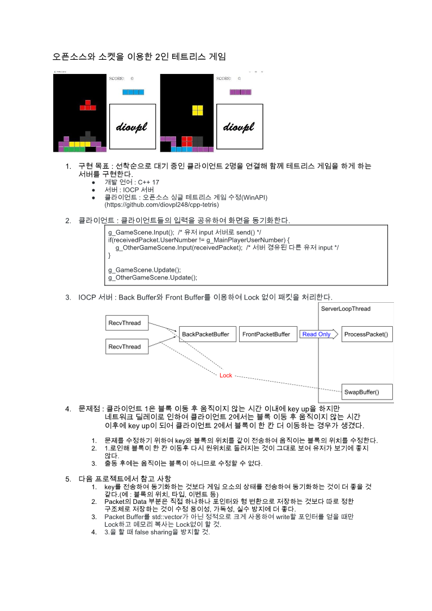

# tetris-server   
   
2020-12   
   
네트워크 프로그래밍의 대학 과제입니다.   
과제 내용 : 기존 오픈소스 싱글 프로그램을 사용한 서버 프로그래밍   
   
사용한 오픈소스 싱글 프로그램 : https://github.com/diovpl248/cpp-tetris    
    
클라이언트 수정 인원 : 팀원 1명 + 본인    
서버 제작 인원 : 본인    
    
[a4 1 페이지 요약 pdf](./테트리스_서버_a4_1_페이지.pdf)    
    
    
